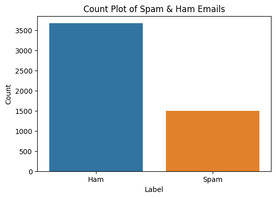

# **Spam Email Classification**

# *Introduction*
In today's digital world, spam emails are a constant nuisance. They clog inboxes, waste time, and can even pose security threats containing phishing attempts or malware. This document details the development of a machine learning model designed to tackle this problem by automatically classifying incoming emails as spam or legitimate (ham).

# *Project Description*
 This is a Machine learning model to classify emails as spam or non-spam, leveraging Python and popular libraries. The project involved preprocessing email text data, extracting relevant features, and training classification algorithms to achieve high accuracy in spam detection.
 
- **Data Overview**
1. The dataset has five columns:
2. Index: A unique identifier for each email.
3. #Sent Emails: How many times the email has been sent.
4. Label: Whether the email is spam or legitimate.
5. Text: The content of the email.
6. Binary Label: A 0 or 1 representing spam or not.

# *Key Achievements*
- **Data Preprocessing:** Cleaned and prepared raw email data, including tokenization, stop-word removal, and feature extraction using techniques like TF-IDF (Term Frequency-Inverse Document Frequency).

- **Model Training:** Implemented and evaluated various classification algorithms such as Naive Bayes, Support Vector Machines (SVM), and Logistic Regression to determine the most effective model for spam detection.
  
- **Data Exploring and Visualizations:**  Provided charts to better understand the data:
  
   1. Histogram
   
 

   2. Pie Chart

.png>)

   3. Word cloud for Spam emails

.png>)

   4. Word cloud for ham emails

.png>)

   5. Top 30 words in Spam Emails

.png>)

   6. Top 30 words in ham emails

 .png>)

# *Model Comparison:*
Tested several algorithms to see which works best:

  **Naïve Bayes**

 - Training Accuracy: 94.00%
 
 - Testing Accuracy: 93.33%

 - Confusion Matrix:

.png>)

  **Logistic Regression**

  - Training Accuracy: 97.00%
  - Testing Accuracy: 96.91%

  - Confusion Matrix:

.png>)

  **SVM**

 - Training Accuracy: 97.34%
 - Testing Accuracy: 97.29%

 - Confusion Matrix:

.png>)

  **Decision Tree**

 - Training Accuracy: 99.85%
 - Testing Accuracy: 95.60%

 - Confusion Matrix:

.png>)

 **KNN**

 - Training Accuracy: 95.14%
 - Testing Accuracy: 90.62%

 - Confusion Matrix:

.png>)

- **Deployment:** Created a simple user interface to input emails and classify them in real-time

# **Contributors**

Zeina Wady

Sara Darwish 

Ruba AbdELSalam 

Basmala Ayman

Sara Habib

Bassant Ahmed
